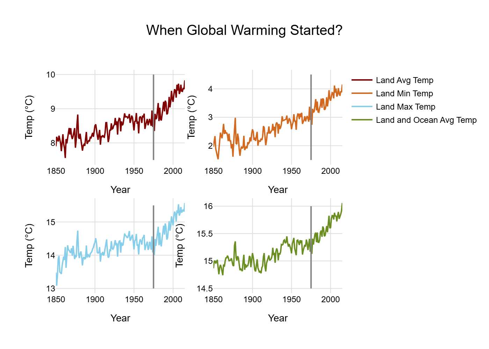
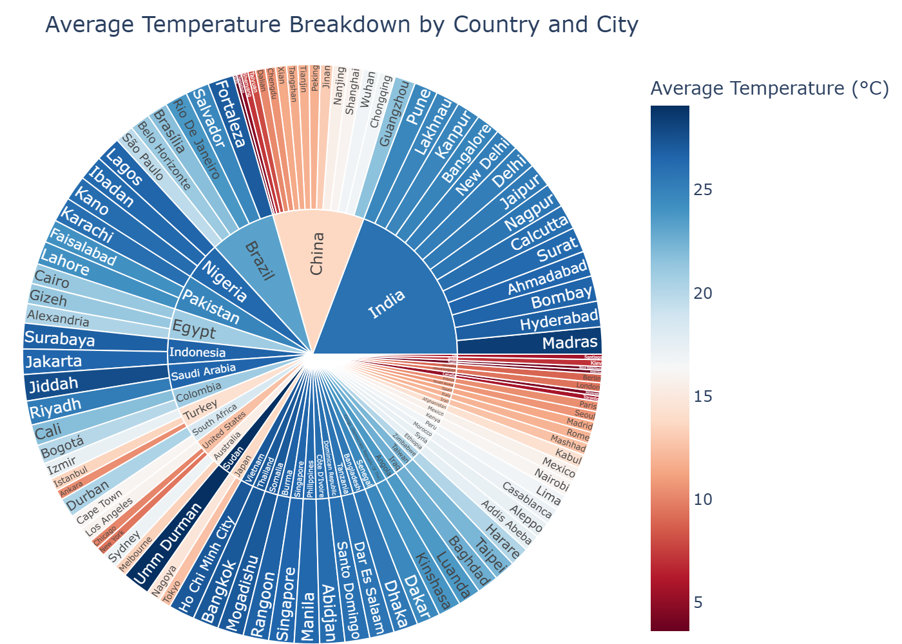
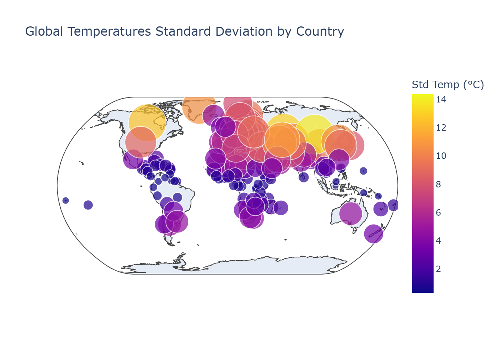
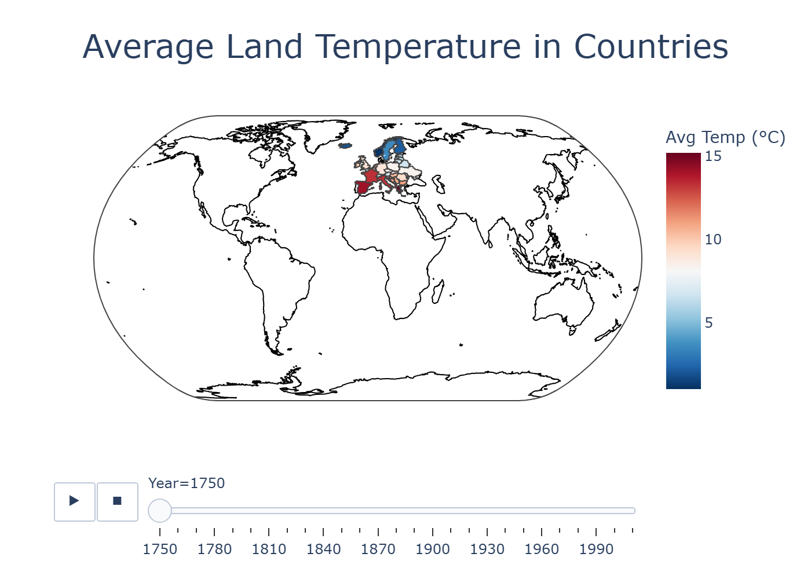
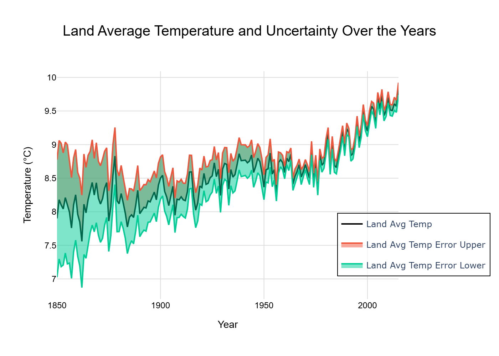

# Temperature Data Visualizations

This repository contains various temperature-related visualizations created using Plotly. Each notebook contains **static image previews** and **interactive HTML plots**.  

> **Note:** Data files are not included in this repository. This README only links to the visualizations.

---

## Notebooks and Charts

### 1. Global Temperature Analysis
**Notebook:** `notebooks/global_temperature.ipynb`

- **Chart:** Land Avg, Min, Max, and Land+Ocean Temperatures  
    
  [View Interactive Plot](charts/global_warming_start.html)

---

### 2. City-Level Temperature Breakdown
**Notebook:** `notebooks/city_temperature.ipynb`

- **Chart:** Average Temperature Sunburst  
    
  [View Interactive Sunburst](charts/sunburst_chart.html)

---

### 3. Temperature Standard Deviation
**Notebook:** `notebooks/temperature_std_dev.ipynb`

- **Chart:** Global Temperature Standard Deviation by Country  
    
  [View Interactive Std Temp Map](charts/temp_std_dev_map.html)

---

### 4. Choropleth Maps
**Notebook:** `notebooks/choropleth_temperature.ipynb`

- **Chart:** Average Land Temperature by Country (Decades)  
    
  [View Interactive Choropleth](charts/choropleth_map.html)

---

### 5. Land Temperature with Uncertainty
**Notebook:** `notebooks/land_temperature_uncertainty.ipynb`

- **Chart:** Land Average Temperature with Uncertainty  
    
  [View Interactive Plot](charts/land_temperature_uncertainty.html)

---

### Notes
- **Static images** are stored in the `images/` folder for GitHub display.  
- **Interactive HTML charts** are stored in the `charts/` folder — open in a browser to interact.  
- **Notebooks** are stored in the `notebooks/` folder.  
- All paths in this README are relative; ensure the folder structure is maintained.
